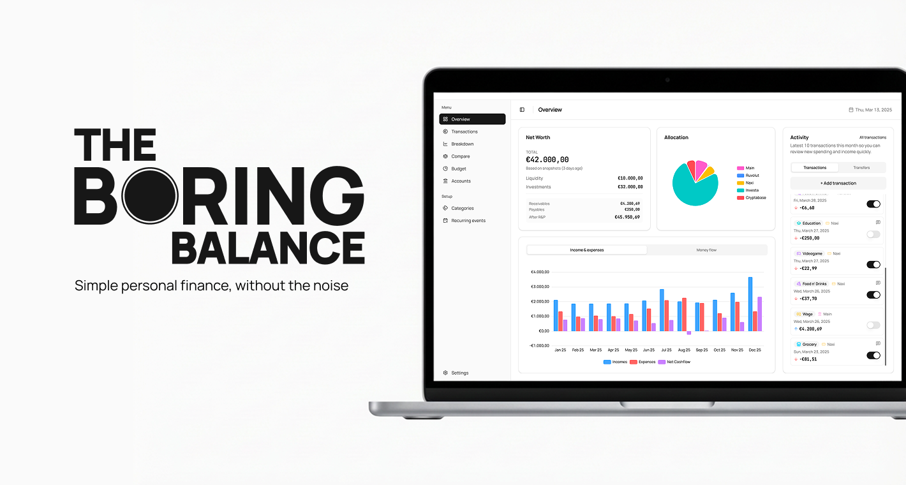
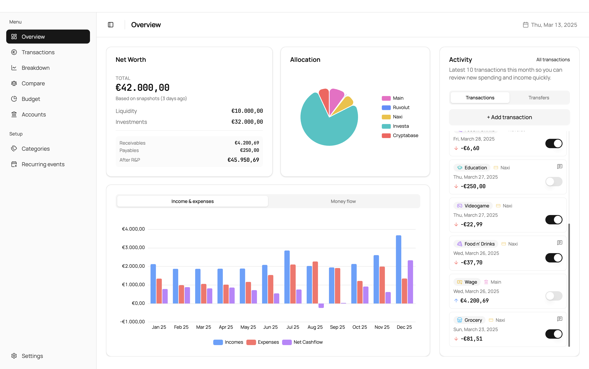

# Boring Balance

Boring Balance is a personal finance tracker built for privacy. It runs locally on your machine, stores your data in a SQLite database, and keeps you in control. There are no accounts, no hosted backend, and no subscriptions. It is built with Angular and Electron for people who want a simple way to track balances, review spending, and stay aligned with their money.



---
 
## Why Boring Balance Exists

This app was built for people who want a simpler, more private way to manage their money.

I created Boring Balance after years of moving between apps, Excel files, and Google Sheets without ever finding something that truly fit my needs. Most tools were either too complicated, full of ads and tracking, or locked behind subscriptions.

So I built my own.

Boring Balance is meant to be simple, private, and completely under your control. Your data stays yours. There are no ads, no tracking, and no features designed to push you into paying just to see your own finances.

I believe personal finance should be something you actively manage. Taking a moment to check your balances, review your expenses, and keep things aligned is the only way to truly understand where your money goes. This app gives you a small set of tools to support that: accounts, transactions, transfers, budgets, recurring events, analytics, backups, import/export, and optional folder-based sync.

All your data lives in a single SQLite file on your own machine. You decide where it is stored, when it is backed up, and whether copies are written to an export destination or a shared sync folder you control. Nothing is sent anywhere unless you explicitly choose where it should go.

Nothing here is forced. Use as much or as little of it as you want.

---

## Core Features

**Overview dashboard.** The Overview page brings together total net worth, account allocation, monthly cashflow, and recent activity so you can review the current state of your finances at a glance.

**Transactions and transfers.** Record income and expenses with a date, account, category, amount, settled state, and description. Transfers are handled separately so moving money between your own accounts does not distort income, expense, or budget reporting.

**Accounts and valuation snapshots.** Boring Balance supports cash, bank, savings, brokerage, crypto, and credit accounts. Each account can have a name, description, icon, and color, and market-based accounts can store manual valuation snapshots for richer net worth tracking.

**Categories.** Organize activity with income, expense, and exclude categories. Categories can carry a description, icon, and color, and can be archived when you no longer want them available in new entries.

**Budgets.** Set category budgets and switch between setup and analysis views to compare targets against actual expenses.

**Recurring events.** Define recurring transactions or transfers with schedule rules such as frequency, interval, start date, and occurrence count, then run them to generate any missing planned entries.

**Breakdown and comparison insights.** The Breakdown and Compare pages let you analyze yearly money flow, category trends, and month-to-month changes side by side through focused tables and charts.

**Backups and restore.** Save manual or automatic recovery copies of the database to a folder you choose, keep a retention window, and restore previous backups directly from the app.

**External folder sync.** The app can save database snapshots into its own sync folder inside a shared location you choose, such as a cloud drive, NAS, or USB drive, so multiple desktop devices can keep balances aligned without relying on a Boring Balance cloud service.

**Excel import and export.** Export your setup and activity to Excel, download the official import template, validate workbooks before import, and bring data in only when the file is clean.

**Offline-first operation.** Boring Balance keeps working locally with no account, no mandatory network connection, and no vendor backend. Backup and sync destinations are optional and entirely user-managed.

---

## Screenshots

### Dashboard



---

## Tech Stack

**Angular 21** is the UI framework. All components are standalone, use `ChangeDetectionStrategy.OnPush`, and `ViewEncapsulation.None`. This keeps the application fast and the styling surface predictable.

**Electron 40** provides the desktop runtime. It wraps the Angular application in a native window and gives it access to the file system, native OS dialogs, and system-level lifecycle events.

**SQLite via better-sqlite3** is the local database. All data is persisted in a single `.db` file managed by the Electron main process. `better-sqlite3` is a synchronous SQLite binding for Node.js, chosen for its simplicity and reliability in a desktop context.

**Tailwind CSS 4.1** handles all styling. The design uses OKLCH color tokens defined in `src/styles.css` for perceptually uniform colors across light and dark themes. Color is used sparingly and with semantic intent — grayscale forms the foundation, and color appears only where meaning requires it.

**Class Variance Authority (CVA)** manages component variants in a type-safe way. It keeps UI component APIs consistent and prevents style drift across the application.

**Lucide Angular** provides the icon set. Icons are used consistently across the interface for account types, categories, and actions.

**ECharts via ngx-echarts** powers all charts and data visualizations. The charting layer is thin — charts are configured programmatically and styled to match the application's design language.

**@ngx-translate** handles internationalization. The application currently ships with English, Italian, Spanish, French, German, Ukrainian, and Chinese translations.

**ngx-Sonner** provides toast notifications for user feedback — confirmations, errors, and status messages.

**TypeScript** is used throughout, in both the Angular renderer and the Electron main process.

---

## Architecture Overview

Boring Balance is structured around the standard Electron model: a main process and a renderer process, communicating over IPC.

**Electron main process** is responsible for native OS integration: creating and managing the application window, accessing the file system, handling application lifecycle events, and managing the SQLite database. The main process is the only part of the application with direct file system access.

**Angular renderer application** is the UI layer. It runs in a Chromium-based renderer process and is built as a standard Angular SPA. All UI logic, state management, and component rendering happens here. The renderer has no direct access to the file system or database.

**IPC communication layer** connects the two processes. The renderer sends typed messages to the main process via Electron's `ipcRenderer`, which handles them and returns results. This boundary is explicit and deliberate — it keeps the UI layer decoupled from native concerns.

**SQLite database** is managed entirely in the main process using `better-sqlite3`. The schema is defined in SQL migration files applied in order on startup. All database reads and writes go through the main process, which exposes them to the renderer via IPC handlers.

**Services and controllers pattern** organizes IPC handlers in the main process by domain — accounts, transactions, transfers, budgets, and so on. In the renderer, Angular services wrap the IPC calls and expose typed results to components.

---

## Privacy Philosophy

Boring Balance collects no analytics, telemetry, or usage data of any kind. There is no tracking code, no error reporting service, and no third-party SDK that phones home.

No account is required to use the application. There is no sign-in, no email address, and no user profile stored anywhere outside your own machine.

All data is stored locally in a SQLite file on your device, in a location you can inspect and manage directly. The application does not send your financial data to any Boring Balance-operated service. If you enable backups, exports, or sync, copies are written only to folders you explicitly choose.

Because there is no hosted cloud backup, you are fully responsible for choosing and managing your own backup or sync destination. This is a deliberate trade-off in favor of privacy and control. Copying the `.db` file to a safe location is always sufficient, and the built-in backup tools simply make that easier.

---

## Getting Started

### Requirements

- Node.js 20 or later
- npm

### Install Dependencies

```bash
npm install
```

### Run in Development Mode

```bash
npm run dev
```

This starts the Angular dev server on `http://localhost:4200` and launches Electron in watch mode via `electronmon`. Changes to both the renderer and the main process are picked up automatically.

### Build the Application

For a full production build and packaged desktop artifact for the current platform:

```bash
npm run build:prod
npm run build:desktop
```

To create distributable installers and archives:

```bash
npm run dist          # current platform
npm run dist:mac      # macOS
npm run dist:win      # Windows (requires Wine/NSIS on non-Windows hosts)
npm run dist:linux    # Linux
```

Build artifacts are written to the `release/` directory. Output is platform-specific — macOS produces a `.dmg` or `.app` bundle, Windows produces an installer and portable `.exe`, and Linux produces an AppImage or `.deb` depending on configuration.

### Database Location

The SQLite database file is stored in the Electron `userData` directory under `data/`:

- Development: `boringbalance.dev.db`
- Production: `boringbalance.db`

You can override the active database environment by setting the `BORINGBALANCE_DB_ENV` environment variable to `dev` or `prod`.

---

## Roadmap

Boring Balance is functional and usable today. Future versions may expand in areas such as:

- Asset and investment tracking with more detailed account valuation history
- Improvements to recurring plan item management and forecasting
- Enhanced analytics and custom reporting
- Import formats to bring in data from banks or other tools

The core philosophy will not change. Boring Balance will remain simple, local-first, and free of tracking or subscriptions. Any new feature will be held to the same standard: it must earn its place, and it must not compromise the clarity or privacy of the existing experience.

---

## Contributing

Contributions, ideas, and feedback are welcome. If you find a bug, want to suggest a feature, or have thoughts on the direction of the project, feel free to open an issue. Pull requests are also welcome — for significant changes, opening an issue to discuss the approach first is appreciated.

---

## License

This project is licensed under the [MIT License](LICENSE).
